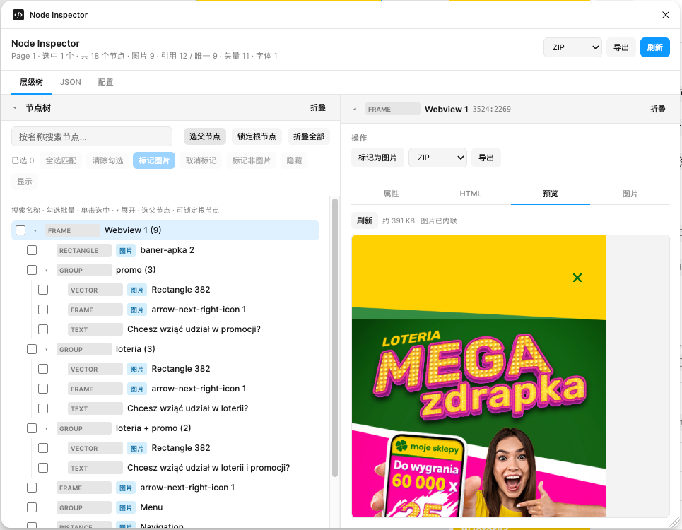
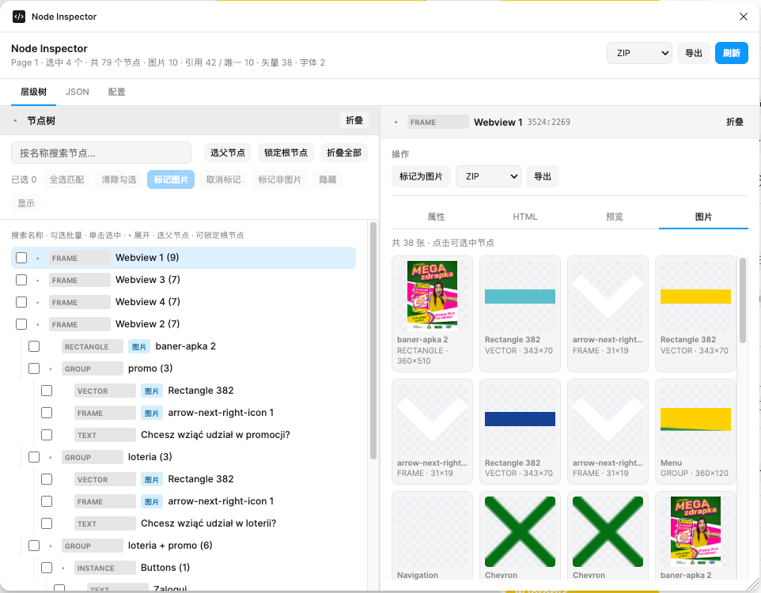
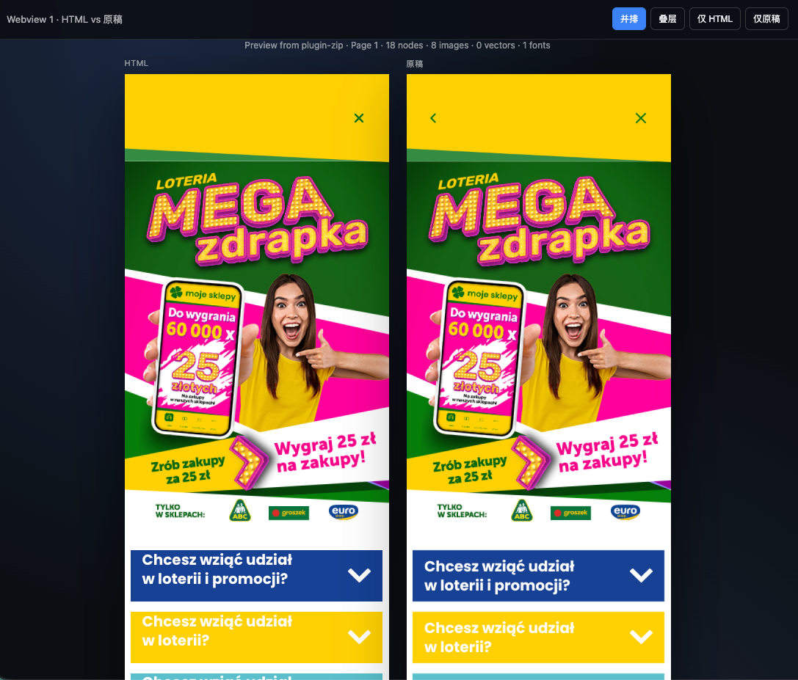
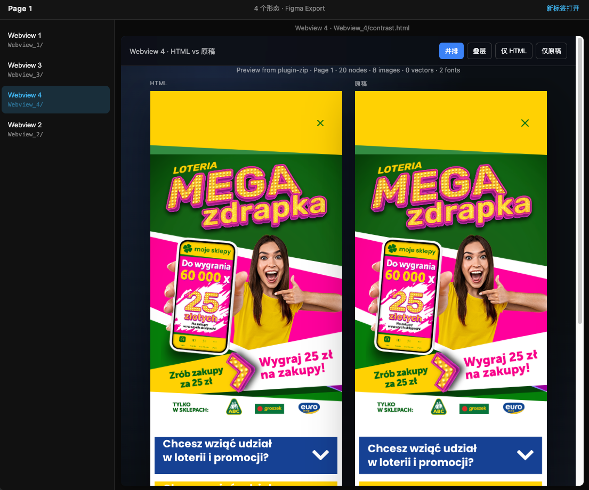

# Node Inspector

Figma 插件：读取画布**所选节点**的完整层级与样式，在面板中树状浏览，并导出 **JSON / HTML / ZIP / 图片**。

> Design → 结构化数据 → 可预览 HTML，覆盖自动切图、资源去重与常见 CSS 还原难点。

**License:** [MIT](./LICENSE)

---

## 亮点

- **选区序列化**：布局（含 Auto Layout）、fills/strokes/effects、文字、组件 Instance / Variant、渐变与图填，输出可消费的 JSON 树
- **智能切图**：按优先级决定「整颗烘焙」还是「展开子层」（用户标记、Mask、矢量组、旋转、白名单形状等），HTML 优先 PNG、SVG 保留可编辑性
- **还原细节**：内侧描边与 padding、`AUTO` 行高探测、字重下限、外侧描边溢出、`parentX/Y` / `rootX/Y` / `bakedVisual` 坐标系约定
- **资源池去重**：填充图与矢量切图像素 / Instance 逻辑键合并，ZIP 只打包实际引用资源
- **工程化导出**：插件面板 + `esbuild` 构建；可选 CLI 从 JSON 再生成 HTML

---

## 演示

### 插件面板

树状浏览选区、标记「按图片导出」、详情内实时预览；顶栏可直接导出 ZIP / HTML / JSON。



多选根节点时统计汇总选区规模，详情「图片」页可浏览当前树下可见切图。



### ZIP 导出结果

`index.html`：一比一样式预览（无对比工具栏）。


`contrast.html`：HTML 与 Figma 原稿并排 / 叠层对照（可切换「仅 HTML」「仅原稿」）。



多根导出时 ZIP 根目录带导航页，侧边切换各形态的对比页。



---

## 快速开始

### 直接使用（无需改代码）

仓库已包含构建产物 `code.js` / `ui.html`。

1. Figma Desktop → Plugins → Development → **Import plugin from manifest…**
2. 选择本仓库根目录的 `manifest.json`
3. 选中画布节点 → 运行 **Node Inspector**

或打包分发：

```bash
npm run pack
# → release/plugin/ 与 release/node-inspector-plugin-v*.zip
```

### 二次开发

```bash
npm install
npm run build
```

`npm run build` 编译 `code.ts` → `code.js`，并把导出模块注入 `ui.html`。

---

## 面板能力

| 能力 | 说明 |
|------|------|
| 节点树 | 递归子层级；隐藏层可搜/取消隐藏，**不导出**其矢量/图片资源 |
| 详情 | 属性 / HTML 源码 / 实时预览 / 图库；可标记「按图片导出」或「非图片」 |
| 根锁定 | 锁定后画布改选区只同步高亮，不换树根 |
| 导出 | JSON / HTML / ZIP（默认）/ 图片 / 说明文档；详情可按单节点子树导出 |
| 配置 | 图片倍率（默认 **2x**）、格式、ZIP 是否含原稿对比 |

配置持久化到 `clientStorage`；「按图片导出 / 非图片」写在节点 `pluginData`，随 Figma 文件保存。

---

## 架构一览

```
Figma 选区
  → code.ts 序列化 + 切图 / 去重
  → ui.html 树浏览 / 预览 / 导出
       └─ JSON / HTML / ZIP / 图片（浏览器下载）
            └─ 可选 CLI：generate:html
```

---

## 设计决策与难点

### 切图判定（高 → 低）

1. **用户标记** `exportAsImage` → 整颗 PNG；`skipImageBake` → 跳过自动切图并展开子层
2. **Mask 组** → 整组 PNG（CSS 无法还原 mask 裁切）
3. **矢量组 / 全形状 Frame / 高密度插画 / 小尺寸 Instance** → SVG + PNG 烘焙
4. **旋转节点**（无文字）→ 烘焙进像素；CSS 友好的纯色/线性渐变矩形、椭圆除外，用 CSS `rotate`
5. **单矢量白名单** → SVG + PNG
6. **其余** → 递归；IMAGE fill 进资源池

形状白名单、CSS 友好矩形/椭圆规则见下文「切图与资源策略」。

### 坐标系

| 字段 | 含义 |
|------|------|
| `parentX` / `parentY` | 相对直接父盒（写 CSS `left/top` 用这对） |
| `rootX` / `rootY` | 相对选区根（对稿 / 钉位） |
| `bakedVisual` | 烘焙图相对父盒的偏移；**勿再减父坐标、勿再 CSS rotate** |

### 描边与 padding

`strokesIncludedInLayout === false`（常见）时，Figma 内侧描边与 padding 重叠 → CSS 保留 `border`，并各向减去 `strokeWeight`。

### 行高 `AUTO`

Plugin API 不给像素值；插件克隆文本节点探测盒高得到 `lineHeightPx`，生成侧优先用该字段。

---

## 序列化内容

- **布局**：x/y/宽高、旋转、约束、Auto Layout、`strokesIncludedInLayout` 等
- **样式**：fills / strokes / effects、圆角、透明度、混合模式、`clipsContent`；绑定样式带 `*StyleId` / `*StyleName`
- **文字**：字号、字体、字重（**下限 400**）、行高（含 `AUTO` → `lineHeightPx`）、字距、对齐、分段、截断
- **组件**：Instance 主组件 id/名、Variant
- **渐变 / 图填**：含 `cssAngle`（线性）、`gradientTransform`、`imageTransform` 等
- **切图标记**：`exportAsImage` / `skipImageBake` / `exportInspectMode`
- **HTML 布局警告**：如大尺寸布尔减挖空 → `htmlLayoutWarning`
- **字体清单**：顶层 `fonts[]`（无法导出字体二进制）

完整字段见 [`docs/node-json.md`](docs/node-json.md)（`npm run docs:json-schema` 可再生成）。

---

## 切图与资源策略

### 形状与例外

- **白名单**：`VECTOR`、`BOOLEAN_OPERATION`、`STAR`、`LINE`、`ELLIPSE`、`RECTANGLE`、`POLYGON`、`WASHI_TAPE` 等
- **CSS 友好 `RECTANGLE` / `ELLIPSE`（不自动切图）**：可见 fills/strokes 均为 `SOLID` 或 `GRADIENT_LINEAR`；含 IMAGE / 径向等仍切图

### 切图像素与布局

| 策略 | 行为 |
|------|------|
| 倍率 | 默认 **2x**（可选 1x/2x/3x）；填充图仍为原图像素 |
| effects | 顶层外阴影/模糊多交由 CSS；`INNER_SHADOW` 常烘焙进 PNG |
| 外侧描边扩盒 | full 切 PNG 时 wrapper 扩边，导出尺寸 = 布局盒 + 描边 |
| 包围盒 | 常规用 `absoluteBoundingBox`；含子层外阴影等时记录实际渲染边界 |

### 资源池与去重

```
images[key] → { mime, dataUrl, byteLength, contentHash, source, refCount }
         或 → { duplicateOf, contentHash }
```

| 来源 | 去重 |
|------|------|
| IMAGE fill | 像素 `contentHash` |
| 矢量 / 标记 PNG | Instance 用主组件 + 归一化尺寸；否则像素 hash |
| ZIP | 只打 HTML 实际引用的图；SVG 外置为 `svgRef` |

---

## HTML / CSS 映射要点

- Auto Layout → `flex`；非 AL 子项按 x/y 绝对定位
- 长度单位固定 **px**
- 字重统一下限 400；行高优先 `lineHeightPx`
- 外侧描边 → `box-shadow` 环；居中描边 → `outline`
- 透明 Group / 文字 / `` 外阴影倾向 `filter: drop-shadow`
- 已烘焙节点不再映射 fill/stroke/圆角到 CSS
- 列表检测附加 `lists`；布局警告带 `data-html-layout-warning`

---

## 插件导出

| 格式 | 说明 |
|------|------|
| **ZIP**（默认） | 预览页 + 可选原稿对比 + 资源 + JSON + 说明文档 |
| HTML | 单页样式还原 |
| JSON | 完整导出树 |
| 图片 | 按倍率/格式导出节点 |
| 说明文档 | JSON 字段说明（ZIP 内会附带 `{name}.md`） |

### ZIP 包内容

| 文件 | 说明 |
|------|------|
| `index.html` | 一比一样式预览 |
| `contrast.html` | 样式 vs 原稿（并排 / 叠层等） |
| `design.png` | 原稿切图（「含原稿对比」默认开） |
| `images/`、`svgs/` | 实际引用资源 |
| `{name}.json` / `{name}.md` | 数据与字段说明 |

多根时按图层名分子目录，并带根导航页。

---

## 命令行

```bash
npm run pack
npm run generate:html -- -i ./export.json -o ./dist/home.html
npm run docs:json-schema
```

---

## 项目结构

```
├── manifest.json
├── code.ts / code.js       # 插件主逻辑（序列化 / 切图 / 去重）
├── ui.html                 # 面板（含注入的导出模块）
├── ui/export-api.mjs       # ZIP / 图片下载 / lists / designPreview 等
├── scripts/
│   ├── build-ui.mjs / pack-plugin.mjs
│   ├── generate-html.mjs
│   └── lib/
├── docs/
│   ├── node-json.md
│   └── assets/             # README 演示图
├── LICENSE
└── package.json
```

---

## 输出结构（节选）

```json
{
  "page": "Page 1",
  "imageExportScale": 2,
  "imageCount": 2,
  "images": {
    "v:c1a2b3c4": {
      "mime": "image/png",
      "dataUrl": "data:image/png;base64,…",
      "contentHash": "…",
      "source": "vector",
      "refCount": 2
    }
  },
  "fonts": [{"family": "Inter", "style": "Regular", "provider": "google"}],
  "nodes": [
    {
      "id": "1:2",
      "type": "FRAME",
      "layout": {
        "width": 320,
        "height": 200,
        "layoutMode": "VERTICAL",
        "padding": {"top": 8, "right": 8, "bottom": 8, "left": 8},
        "strokesIncludedInLayout": false
      },
      "styles": {"fills": [], "strokes": [], "effects": []},
      "children": []
    }
  ]
}
```

完整字段以 [`docs/node-json.md`](docs/node-json.md) 为准。

---

## 说明与限制

- 只读当前页 `selection`，不扫整份文档
- 无网络权限（`allowedDomains: none`）
- 图走 Plugin API（无 REST 限流）；图片多时 JSON 因 base64 变大属预期，ZIP 会去掉未引用图
- 无法导出字体文件；Google 字体靠 HTML CDN，系统字体走本机栈

---

## License

[MIT](./LICENSE) © 2026 杜豪
